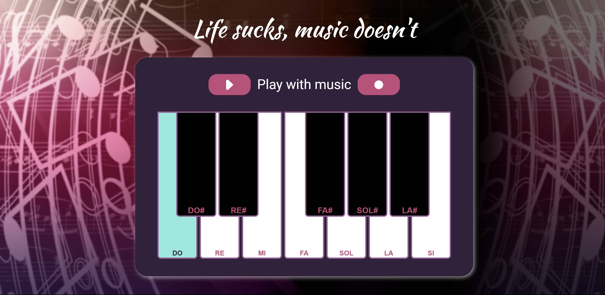
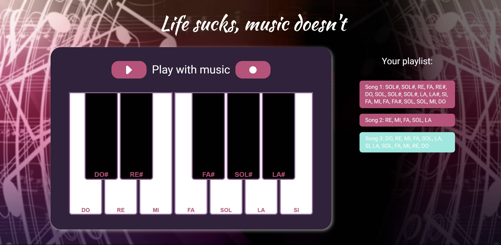

# React-Piano
React-Piano is a web application created as a personal project after completing the Nuclio Digital School Bootcamp of the June 2023 cohort. It allows the user to play with a simple piano and create songs to play them back.

## Table of Contents

1. Project Description
2. Platform Walkthrough
3. Technologies Used
4. Installation
6. Project Lead
   
# Project Description
React-Piano is a responsive web application that adapts to various PC screen types. It allows the users to play music on a piano created with React. Users can simply play the keys to listen to some music or store songs into a playlist. 

The frontend is built entirely with React and CSS.

This project aims to solidify the concepts studied and applied during the completed master's program.
 

# Platform Walkthrough

### Piano
This single-page web application features an array of vibrant colors. Simple and unpretentious, users can easily create music by clicking on the piano keys. 

The keys change their color when hovered or clicked, helping users to understand what they are playing.



### Playlist
Located at the top of the piano are two buttons that allow users to play or record a song.

Clicking the record button initiates recording, enabling users to play notes. To stop recording, users simply press the stop button. Subsequently, a playlist containing the recorded song’s notes is generated.

Users can store as many songs as they desire, with each new entry appearing below the previous one. Playing a song from the playlist is as easy as clicking on it and then hitting the play button. The selected song will play back automatically.

Immerse yourself in the world of music! I hope you enjoy it!




# Technologies Used
### Main Front-End Libraries:

* React

# Installation

## 1. Configuration:

* Clone this repository to your local machine:
````
$ git clone https://github.com/Ananke85/React-Piano.git
````
* Install project dependencies:
```
$ npm install
````
* Open a terminal and start the client:
```
$ cd mypianoapp
$ npm run dev
````
* Open a web browser and go to the following port to view the application:
```
http://localhost:5173/

# Project Lead
Lorena Carmona

